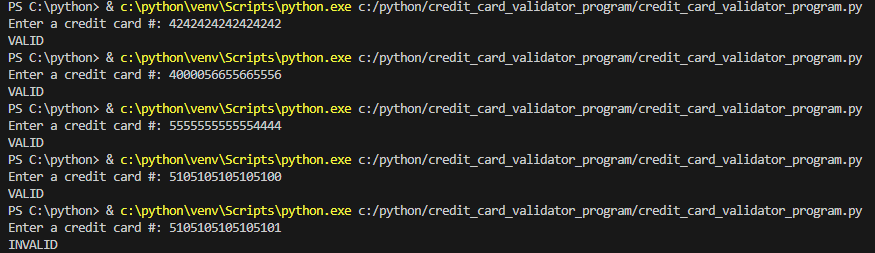

# Credit Card Validator Program

## Description

    The purpose of this app is to be able to identify a valid credit card number.

## Steps taken to develop this project

1. First step is to define all the important variable and an input to insert the given credit card number.

2. Next step is to remove - or spaces in the from the credit card inputed.

3. Then the next step is to add all digit in the odd place from right to left.

4. Then we double every second digit from right to left if the result is a two digit number, add the two digit number together to get a single digit

5. Next step is to sum the total of step 3 and step 4

6. If the sum is divisible by 10 with no remainder, the credit card is valid.

## OUTCOME

